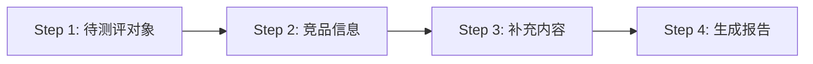

# UX 竞品对比测评工作流

串行四步流程，结合 ux-evaluator 技能生成含左侧导航栏的竞品对比体验测评报告。

## 工作流总览

## 执行步骤

### Step 1 — 待测评对象

通过 `clarify` 工具向用户提问，获取待测评的网站/产品的 URL 或名称。

**问题模板：**
> "请提供你要测评的产品或网页地址（URL），例如：www.example.com"

**产出：** 记录目标页面 URL/名称 → 用 `web_extract` 或 `vision_analyze` 获取内容。

---

### Step 2 — 竞品信息

通过 `clarify` 工具向用户提问，收集竞品信息。

**问题模板：**
> "请提供竞品的信息（URL、名称或截图）。如果是网页，我可以直接抓取分析。"

用户提供 URL 时：用 `web_extract` 或 `vision_analyze` 自动获取竞品内容。
用户提供名称/截图时：记录文本描述或分析截图。

**产出：** 竞品的内容/描述数据。

---

### Step 3 — 补充内容

通过 `clarify` 工具询问用户是否有补充信息。

**问题模板：**
> "还有其他需要补充的信息吗？比如：特定用户场景、重点关注维度、内部数据或背景说明？"

**产出：** 用户的补充说明文本。

---

### Step 4 — 生成报告（必须包含左侧导航栏）

结合 Step 1-3 的输入，使用 **ux-evaluator** 技能进行测评。

**前置：** 必须加载 `ux-evaluator` skill 的 `assets/report-template.html` 模板作为报告骨架。

#### 报告必须包含的结构

报告必须在 `.layout` 容器内同时包含两个部分：

**1. 左侧固定导航栏（.sidebar）**
- 使用 `position: sticky; top: 24px` 固定在左侧
- 宽度 200px，有独立滚动条（max-height: calc(100vh - 48px)）
- 导航项：
  - 📊 综合评分 → `#score-overview`
  - 📐 测评逻辑清单 → `#methodology`
  - 🎨 视觉层 → `#visual`
  - 🖱 交互层 → `#interaction`
  - ✍️ 文案层 → `#copy`
  - 📈 转化漏斗 → `#funnel`
  - ✅ 核心优点 → `#strengths`
  - 🔧 改进建议 → `#improvements`
  - 📋 改进清单总览 → `#summary`
  - 🏁 竞品对比速览 → `#competitor`
  - 🔍 转化对照清单 → `#checklist`
- 当前章节高亮（`a.active` 类）
- `scroll-spy`：滚动时自动高亮当前章节

**2. 主内容区（.main-content）**
- `flex: 1; min-width: 0`
- 每个 section 必须有对应的 `id` 属性与导航锚点一一对应

**3. 移动端适配**
- 屏幕 ≤960px 时侧边栏隐藏，底部浮动按钮 `☰` 唤起抽屉式侧边栏
- 点击遮罩关闭

#### 评分流程

1. 判断页面类型（品牌宣传类/购买类/操作类/资料类），使用对应的权重公式
2. 按 ux-evaluator 评分体系进行四维度评分
3. 在每个维度分析卡片（dim-item）中增加竞品对比评注（.item-competitor 样式块）
4. 改进建议每条含竞品参考对比
5. 新增「竞品对比速览」章节（#competitor），用表格横向对比三家
6. 如有用户补充内容，在方法说明区备注
7. 使用 `write_file` 生成完整的 HTML 报告文件

#### 报告预检清单（生成前逐项确认）

| # | 检查项 |
|---|--------|
| 1 | 是否有 `.layout` 容器包含 sidebar + main-content |
| 2 | 侧边栏 `a` 标签的 `href` 是否与各 `section` 的 `id` 一一对应 |
| 3 | scroll-spy JavaScript 是否正常工作 |
| 4 | 移动端 `☰` 按钮和遮罩层是否就位 |
| 5 | 所有 `{{占位符}}` 全部已替换 |
| 6 | 竞品对比速览表格是否存在（#competitor） |
| 7 | 改进建议是否有 P0/P1/P2 标记 |
| 8 | 综合评分与各维度进度条颜色匹配（≥80绿/#1a7f5a, 60-79琥珀/#c8892b, <60红/#c0453a） |

## 前置条件

- ux-evaluator skill 已安装（路径：/root/.hermes/skills/creative/ux-evaluator/）
- 报告模板路径：`/root/.hermes/skills/creative/ux-evaluator/assets/report-template.html`
- 需要网络访问用于抓取网页

## 注意事项

- Step 1-3 的 clarify 调用依次进行，每一步等待用户回复后再继续
- 竞品页面如果无法自动抓取（如需要登录），记录用户提供的描述
- 最终报告的评分以**待测评对象**为准，竞品信息作为对比参照而非评分对象
- 生成的 HTML 报告保存到 workspace 目录，文件名格式：`{目标名}-compare-report.html`
- 报告文件生成后，用 `MEDIA:/absolute/path` 内联展示给用户

### 已知问题与规避

- **🚨 MEDIA 内联预览导航栏不可见**：WebUI 的 MEDIA 内嵌预览视口较窄，左侧 sticky 导航栏可能被压缩或不可见。解决方式：**告知用户在新标签页中打开 HTML 文件**，或提供文件路径让用户自行在浏览器打开。不要以此推断导航栏缺失而重写报告。
- **🚨 超长报告文件生成超时**：完整报告（含完整 CSS/JS/分析内容）约 30-50KB，若 write_file 超时，可先分段生成小文件验证结构，再生成完整文件。
- **🚨 web_extract 可能获取不到完整页面**：部分页面需要登录或依赖 JS 渲染（CSR：Svelte/React/Vue）。此时改用 `vision_analyze`（截图）或浏览器工具，并在报告中注明数据来源限制。
- **🚨 CSR 页面的测评局限性**：Svelte/React 等 CSR 页面，`web_extract` 只能拿到框架代码和内嵌 JSON 数据，无法获取渲染后的完整页面结构。此时：
  1. 尝试用 browser 工具渲染后再提取
  2. 如果不可行，基于提取到的数据和用户提供的描述进行评估
  3. 在报告中标注「本页面为客户端动态渲染，分析基于页面数据摘要」
